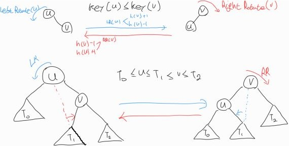

# AVL Tree
a binary search tree T S.T. `height-balanced` property holds    
height-balanced: For every node v ∈ |h(v.left())-h.(v.right()) ≤ 1    
 
즉, 모든 노드에 대해서 왼쪽 서브트리와 오른쪽 서브트리의 높이가 많이 나봐야 1인 트리    
따라서, height-balanced를 만족한다.    
 
> <참고>밸런스가 있는 2가지 경우    
> height-balanced / weight-balanced

### Theorem
- The height of an AVL tree of n elements is O(logn)
    - complete binary tree는 아니지만, complete binary tree도 왼쪽과 오른쪽의 subtree의 height의 차는 최대 1을 유지한다.
    - complete binary tree에서 h는 최대 logn임을 증명했다.
    - 그 증명을 토대로 O(logn)임을 쉽게 증명할 수 있다.

## 제공 메소드
Rotation 메소드: insertion or deletion 수행 후 height-balanced를 유지하기 위한 메소드
- LeftRotation(u)
- RightRotation(v)    

### Insertion
1. Perform normal BST insertion
    - 삽입 경로에 있던 일부 노드들이 h가 증가할 것이다.
2. Find the bottommost unbalanced node, z on the insertion path from w to root
3. Restructure the tree at z to be a prper tree
    - z 노드를 기준으로 balance를 맞추기 위해 Rotation 을 수행한다.
- Time Complexity는 O(logn)이다.
    - BST 삽입과 동일하게 수행하게 삽입한다 여기서 logn이 수행되고,
    - 밸런스가 맞지 않는 노드를 찾는 수행에서 최악의 경우 root에서 leaf노드까지 수행해야 하므로 O(logn)을 수행한다.
#### insert 시 주의해야할 Fact
- insert 후 항상 root node까지 h가 증가하지 않는다.
    - root node의 left subtree의 높이가 h+1, right subtree의 높이가 h라하자.
    - right subtree에 새로운 노드가 추가 될 경우, 전체의 높이는 h+1로 변함이 없다.
- 임의의 노드 z의 left subtree 높이가 h+1, right subtree 높이가 h로 ALV Tree를 유지한다고 하자.    
insert를 임의의 노드 z의 left subtree에서 수행될 경우    
z의 left Child의 left, right subtree의 <u>h는 같을 수 없다.</u>
    - ??
### Deletion
1. Perform a normal BST deletion
2. Find the bottommost unbalanced node, z along the deletion path.
    - 삭제하면서 level이 줄어들어 balance가 맞지 않을 수 있다. 그 노드를 찾는다.
3. Restructure the tree
    - in-order에 맞게 Rotaion을 수행한다.
- O(logn)

pdf 이미지 참고해서 보는 것을 추천함.