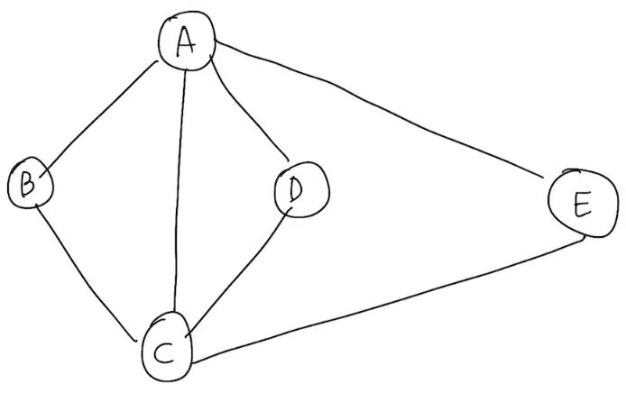

# Breadth-First Search
너비 우선 탐색: 신중하게 주변을 살피고 나아가는 traversal    
자기 자신의 neighbors들을 모두 살피며 탐색함    
<br>

---

알고리즘
```c++
BFS(G, v):
    Q.enqueue(v);
    mark v as "visited";
    while(Q is not empty){
        v <- Q.dequeue();
        for w ∈ neighbors(v){
            if w is "unvisited":
                Q.enqueue(w);
                mark w as "visited";
        }
    }
```

Time Complexity    
if G is represented as adjancency list:  O(n+m)    

## 알고리즘에 따른 경로
    

BFS(G, A):    
mark A as "vistied"
- Q:[ A ]
1. while state start, dequeue -> A
    - Q: [ A ] -> [ ]
    1. B is A's neighbors and "Unvisited"
        - Q: [ B ]
        - mark B as "visited"
    2. C is A's neighbors, and "Unvisited"
        - Q: [ B, C ]
        - mark C as "visited"
    3. D is A's neighbors, and "Unvisited"
        - Q: [ B, C, D ]
        - mark D as "visited"
    4. E is A's neighbors, and "Unvisited"
        - Q: [ B, C, D, E ]
        - mark E as "visited"
2. dequeue -> B
    - Q: [ B, C, D, E ] -> [ C, D, E ]
    1. A is B's neighbors, but "visited"
    2. C is B's neighbors, but "visited"
3. dequeue -> C
 - Q: [ C, D, E ] -> [ D, E ]
    1. A is C's neighbors, but "visited"
    2. B is C's neighbors, but "visited"
    3. D is C's neighbors, but "visited"
    4. E is C's neighbors, but "visited"
4. dequeue -> D
    - Q: [ D, E ] -> [ E ]
    1. A is D's neighbors, but "visited"
    2. C is D's neighbors, but "visited"
5. dequeue -> E
    - Q: [ E ] -> [ ]
    1. A is E's neighbors, but "visited"
    2. C is E's neighbors, but "visited"

=> A -> B -> C -> D -> E

---

## 용어

- Hop
    - 시작한 vertex를 기준으로 다른 vertex까지의 neighbor 관계
        - 친구의 친구의 ... 
        - A에서 BCD는 1-hop 관계이다.
        - A에서 EF는 2-hop 관계이다. 
    - i-hop 관계까지 edge의 수는 i개 이다.
        - L_i에서 임의의 vertex v에 대해
            - 시작 vertex부터 v까지 edge의 수는 i개이다.
            - 그래프에서 s부터 v까지의 모든 경로는 최소 i개의 edge를 가진다.
- Tree edge(= Discovery edge)
    - Traversal 경로에 있는 edge
    - 실선 화살표
- Cross edge
    - 탐색을 하려 했으나 이미 "Visted"된 vertex라 가지 못한 edge
    - 점선 화살표
    - cross edge가 아닌 두 개의 vertices의 level 수 차이는 최대 1이다.
        - pf) BFS는 현재의 vertex에서 연결된 edge들을 먼저 모두 방문을 하기 때문에 만일 level 2 이상 차이나는 edge가 존재한다면, 그 이미 해당 vertex에서 첫번째로 방문한 것이다.    
        따라서, 이미 2이상 차이나는 edge는 cross edge일 것이다.
    
    - [Back edge](./DFS.md/#Back_edge)와 다르다
- BFS Tree
    - tree edge로 연결된 subgraph
    - BFS Spanning Tree
        - 모든 vertex를 가지므로 Spanning tree이다.
---
## [DFS vs BFS](./Graph.md/#DFS_vs_BFS)