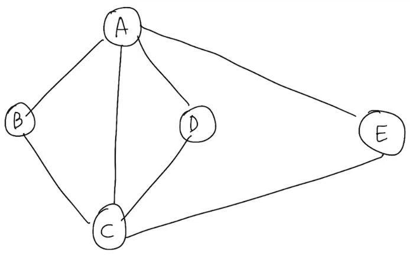
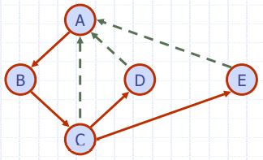
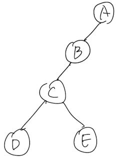

# Depth-First Search
깊이 우선 탐색: 일단 나아가고 보는 traversal    
ex) Preorder, Post order traversal

---
Algorithm
```c++
DFS(G, v):
    mark v as "vistied";
    for each ∈ neighbors(v):
        if w is "unvisited":
            DFS(G, u);
```
Time Complexity    
if G is represented as adjancency list:  O(n+m)    
In matrix: O(n^2)

## 알고리즘에 따른 경로

DFS(G, A):
1. mark A as "visited"
    - B is A's neighbors
    - DFS(G, B)
    2. mark B as "visited"
        - C is B's neighbors
        - DFS(G, C)
        3. mark C as "visited"
            - A is C's neighbors
                - but, A is "visited"
            - D is C's neighbors
            - DFS(G, D)
            4. mark D as "visited"
                - A is D's neighbors
                    - but, A is "visited"
                - there is no neighbors
                - return back     
            - In C's DFS(G, C), find C's neighbors
            - E is C's neighbors
            - DFS(G, E)
            5. mark E as "visited"
                - all neighbors is "visited"
                - return
            - all neighbors is "visited"
            - return
        - all neighbors is "visited"
        - return
    - all neighbors is "visited"
    - return

=> A -> B -> C -> D -> E의 순서로 traversal 한다.

---

## 용어

- Tree edge(= Discovery edge)
    - Traversal 경로에 있는 edge
    - 붉은 화살표
- Back edge
    - 탐색을 하려 했으나 이미 "Visted"된 vertex라 가지 못한 edge
    - 점선 화살표
    - 이 edge가 존재하면, cycle이 존재함을 알려준다.
    - [Cross edge](./BFS.md/#Cross_edge)와 다르다
- DFS Tree
    - tree edge로 연결된 subgraph
    - DFS Spanning Tree
        - 모든 vertex를 가지므로 Spanning tree이다.
    - DFS Tree를 다시 그려보면 다음과 같다.    
        

---

## Finding method
- Path Finding: vertex에서 다른 vertex로 가는 경로를 알려준다.
    - Algorithm
        ```c++
        Algorithm pathDFS(G, v, z)
        Input graph G =(V, E) and a start vertex v ∈ V
            S.push(v)
            mark v as VISITED
            if v = z
                return S.elements()
            for all w ∈ {neighbors of v}
                if w is marked as UNVISITED
                    pathDFS(G, w, z)
            S.pop(v)
        ```
        - O(n+m) Time
- Cycle Finding: cycle path를 알려준다.
    - Algorithm
        ```c++
        Algorithm cycleDFS(G, v)
            S.push(v);
            //여기서부터
            mark v as VISITED;
            for all w ∈ {neighbors  of v}
                if (w, v) is UNEXPLORED;
                    if w is marked as UNVISITED
                        mark (w, v) as  EXPLORED;
                        cycleDFS(G, w);
                //여기까지 basic DFS와 같다.
                else
                // back edge를 찾았을 때
                    T <- new empty stack;
                    while(o != w);
                        o <- S.pop();
                        T.push(o);
                    return T.elements();
            S.pop(v);
        ```
        - O(n+m) Time

---
## [DFS vs BFS](./Graph.md/#DFS_vs_BFS)