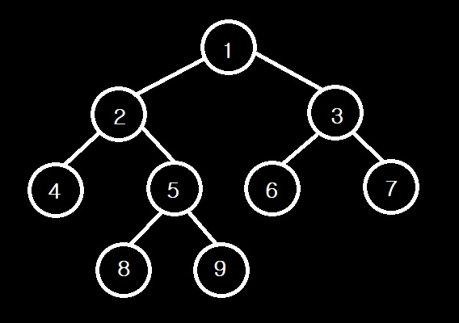

# Tree
컴퓨터 과학에서 Tree는 계층 구조의 추상 모델이다.    
즉, `상하관계`가 있고 `abstract data type`이다.    
Tree는 부모 자식 관계를 가진 노드들로 구성되어 있다.    
***
## 트리 용어 정리

* Root
    * 부모가 없는 노드
    * 1번 노드가 Root 노드이다.
* Internal node(= `Non-leaf node`)
    * 자식이 적어도 하나 있는 노드
    * 1, 2, 3, 5
    * non-terminal 노드라고도 한다.
* External node(= `Leaf node`)
    * 자식이 없는 노드
    * 4, 8, 9, 6, 7
    * terminal 노드라고도 한다.
* Ancestor
    * 한 노드를 기준으로 그 노드의 위로 연결된 노드들
    * 자기 자신도 포함
    * 9의 조상은 1, 2, 5이다.
    * 4, 6, 7, 3은 9와 직접 연결되어 있지 않으므로 조상이 아니다.
* Descendant
    * 한 노드를 기준으로 그 노드의 아래로 연결된 노드들
    * 자기 자신도 포함
    * 조상 노드의 역이다.
    * 9는 1, 2, 5의 후손이다.
* SubTree
    * 한 노드를 기준으로 그 노드의 모든 후손으로 구성된 트리
    * 2 - 4 - 5 - 8 - 9 tree는 전체 트리의 Subtree이다.
* Edge
    * 관계가 있는 두 노드간에 연결선
    * 1 - 2 / 5 - 9 etc..
* `Path`
    * 어떤 노드에서 다른 노드로 가는 방법 / 경로
* Sibling
    * 같은 부모를 가진 노드들의 집합
    * 4 - 5는 Sibling이다.
    * 2 - 3은 Sibling이다.
    * etc..
* `Depth`
    * Root node까지의 edge의 수
    * 5의 depth는 2이다.
* `Level`
    * Root node까지의 node의 수
    * 흔히 depth + 1이다.
    * 5의 level은 3이다.
    * level 3: 4, 5, 6, 7
* `Height`
    * Leaf node까지의 edge의 수
    * 5의 height는 1이다.
    * 4의 height는 0이다.
***
## Tree Interface Method
```c++
class Node{
    E element
    Node* parent;
    List<Node*> children;

    Node parent();  //현재 노드의 부모노드를 반환한다.
    list<Node> children();  //현재 노드의 자식들을 반환한다.

    bool isRoot();  //root노드인지 check
    bool isLeaf();  //leaf노드인지 check
}
class Tree{
    Node* root;
    List<Node*> nodes;

    int size(); //tree의 사이즈 반환
    bool empty();   //tree가 비어있는지 check

    Node root();    //root 노드를 반환한다.
    list<Node> nodes(); //전체 트리를 반환한다.
}
```
***
`일단 참고`    
depth 함수 recursion 함수로 구현
```c++
int depth(v){
    if(v.isRoot())
        return 0;
    else
        return 1+depth(v.parent())
}
```
Height 함수 구현
```c++
int height(v){
    if (v.isLeaf())
        return 0;
    else{
        for(auto temp : v.children())
            h = max(h, height(u))
        return h + 1;
    }
}
```
Time Cost: O(# of descendants)    
Space Cost: O(h of descendents)
***
## Traversal
1. Preorder Traversal
    * 1 - 2 - 4 - 5 - 8 - 9 - 3 - 6 - 7
    * Example: 프린터
    * Algorithm
    ```c++
    Algorithm preOrder(v)
        visit(v)    //여기가 keypoint
        for each child w of v
            preorder (w)
    ```
3. Postorder Traversal
    * 4 - 8 - 9 - 5 - 2 - 6 - 7 - 3 - 1
    * Example: 저장된 폴더 사이즈 계산
    * Algorithm
    ```c++
    Algorithm postOrder(v)
    for each child w of v
        postOrder (w)
    visit(v)    //여기가 keypoint
    ```
2. Inorder Traversal
    * 4 - 2 - 8 - 5 - 9 - 1 - 6 - 3 - 7
    * Example: [binary tree](#Binary-Trees) 그리기
    * Algorithm
    ```c++
    Algorithm inOrder(v)
        if  v.isLeaf()
            inOrder(v.left())
        visit(v)    //여기가 keypoint
        if  v.isLeaf()
            inOrder(v.right())
    ```
4. Euler-Tour Traversal
    * 1 - 2 - 4 - 2 - 5 - 8 - 5 - 9 - 5 - 2 - 1 - 3 - 6 - 3 - 7 - 3 - 1
    * 자기 자신을 다시 돌아옴
    * preoreder/ inoreder/ postoreder의 종합 형태
    * Example: Print Arithmetic Expressions
    ```c++
    Algorithm printExpression(v)
        if(!v.isExternal()){
            print("("); //preorder
            printExpression(v.left());
        }

        print(v.element())  //inorder

        if(!v.isExternal()){
            printExpression(v.right())
            print (")") //postorder
        }
    ```
    * Algorithm
    ```c++
    Algorithm EulerTour(v)
        visit(v);    //preorder
        
        EulerTour(v.Left());

        visit(v);    //inorder
        
        EulerTour(v.Right());

         visit(v);    //postorder
    ```
5. Level-Order Traveral
    * 1 - 2 - 3 - 4 - 5 - 6 - 7 - 8 - 9
    * 각 레벨 순서에 따라 탐색 (너비 우선 탐색)
    * [Queue](./Queue.md/#Queue)를 사용하여 구현한다.
    * Algorithm
        * 재귀함수가 아님을 인지하자.
    ```c++
    Algorithm levelOrder(v)
        Q.enqueue(v)
        while (!Q.isEmpty()){
            u ← Q.dequeue()
            visit(u)
            for each child w of u
                Q.enqueue(w)
        }
    ```
    * `Time Cost: O(n)`
    * `Space Cost O(L)`
        * L: i번째 노드 수 들 중 가장 큰 값 (0 ⪯ i ⪯ h)
***
## Binary-Trees
Binary tree는 다음의 조건을 따르는 순서화된 트리이다.
* 각 non-leaf 노드는 최대 두개의 자식을 가진다.
* 한 노드의 자식은 순서화된 페어이다.
    * 즉, 왼쪽 자식과 오른쪽 자식은 순서를 가진다.(상하 관계가 생긴다)    
### 용어 정리
* Proper binary tree
    * 각 노드가 2개 또는 가지지 않을 때 Proper binary tree이다.
    * 위 그림은 Proper binary tree이다.
* Complete binary tree
    * 모든 노드가 Left child 부터 채워졌을 경우 Complete binary tree이다.
    * 위 그림은 4번 노드의 자식이 5번 보다 먼저 채워져야 하나 그렇지 않으므로, Complete binary tree가 아니다.
### Binary Tree의 속성
n: 노드의 수    
m: non-leaf 노드의 수    
l: leaf 노드의 수    
h: height    
* General Binary Tree
    * h+1 ⪯ n ⪯ 2^(h+1) - 1
    * h ⪯ m ⪯2^h - 1
    * (0 or 1) ⪯ l ⪯ 2^h
    * log(n+1) - 1 ⪯ h ⪯ n - 1
    * 위 식으로 유도된 big oh notation
        * O(logn) ⪯ O(h) ⪯ O(n)
* Propoer Binary Tree
    * l = m + 1
    * logl ⪯ h ⪯ m
    * n = 2l - 1
    * h ⪯ (n-1)/2
    * l ⪯ 2^h
    * log(n+1) - 1 ⪯ h
***
## Structure for Tree
### Linked structure
1. General Trees
    * [Tree Interface Method](#Tree-Interface-Method) 참고
2. Binary Trees
    * 자식이 최대 2개 까지만 가질 수 있으므로 children을 벡터로 구현할 필요가 없다.
    * Algorithm
    ```c++
    class Node{
        E element
        Node* parent;
        Node* Left_child;
        Node* Right_child;

        Node parent();  //현재  노드의 부모노드를 반환한다.

        Node Left_child();
        Node Right_child();

        bool isRoot();  //  root노드인지 check
        bool isLeaf();  //  leaf노드인지 check
    }
    ```

### Array-Based Binary Trees
Array-based Tree는 [Heap](./Heap.md)에서 다시 확인
* 일반 배열을 배열 기반으로 만들기는 불가하다.
    * 자식의 수가 정해져 있지 않으므로 배열 할당이 동적이며 매우 비효율적이다.
* Array의 index로 자식을 표현한다.
    * 2진 트리는 자식을 최대 2개를 가질 수 있으므로, 자식이 없어도 2칸을 비워두고 그 다음 칸에 다른 노드의 자식을 넣음으로써 표현이 가능하다.
    * 각 level에 노드 수는 2^n 이므로, 각 level마다 할당 해주어야 할 배열 공간은 2^n이다.
* Algorithm
```c++
Node v is stored at A[index]
    root_index = 1
    if node is the left child of parent(node)
        left_child_index = 2 * parent_index
    if node is the right child of parent(node)
        right_child_index = (2*parent_index) + 1
```
Time Cost: O(n)    
Space Cost: O(2^n)
* n개의 노드가 right child로만 추가가 된다면 저장공간은 2^n로 커진다.
* max child num + 1
